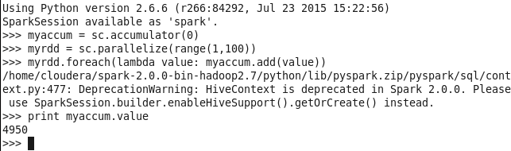
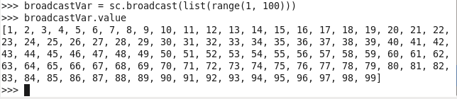
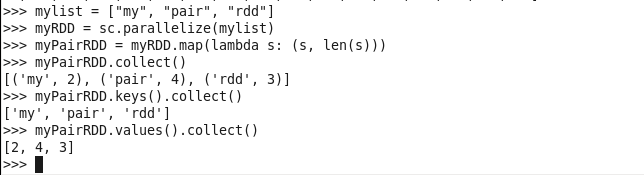
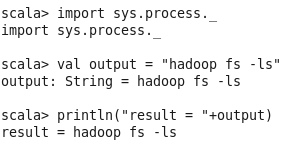
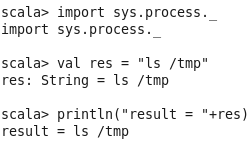
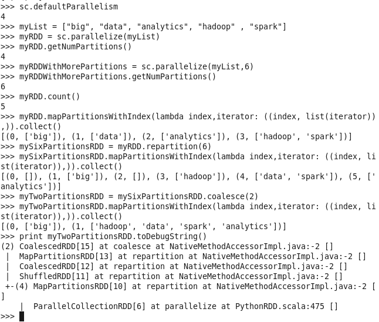

## Nama      : Alfinza Sanjaya Putra
## Kelas     : TI - 3C
## No. Absen : 02

BIG DATA - Chapter 3

## Hasil

## Accumulator

## Broadcast

## PairRDD

## SystemCommandsOutput

## SystemCommandsReturnCode

## UnderstandingRDDs

## WordCount

Kode 1: sc, accumulator, parallelize, lambda, value
Kode 2: broadcast, list, range
Kode 3: textFile, filter, cache, count
Kode 4: map, collect, len, keys, values
Kode 5: defaultParallelism, getNumPartitions, mapPartitionsWithIndex, repartition, coalesce, toDebugString
Kode 6: flatMap, reduceByKey, split
